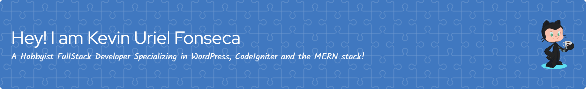

# Hi, I'm Kevin 👋



[](https://wakatime.com/badge/user/684e12ee-ee44-4f33-8d51-0e2cd1e90dab/project/d5d71a2b-dfa0-493a-968e-37372d302991)

<a href="https://app.daily.dev/kirasiris"></a>
```js
const profile = {
  username: "kirasiris",
  fullName: "Kevin Uriel Fonseca",
  description: "I'm just in love with JS, PHP and SQL",
  location: "Fort Worth, TX",
  occupation: ['The U.S. Army Veteran', 'UPS Driver'],
  education: [
   {
     "name":  "Tarleton State University",
     "graduationDate": "June 21, 2024",
     "major": "B.A.A.S in IT"
   },
   {
     "name":  "Tarrant County College",
     "graduationDate": "May 05, 2021",
     "major": "A.A.S in IT"
   },
  ],
  skills: [
    "bootstrap-3",
    "bootstrap-4",
    "codeigniter",
    "sass",
    "php",
    "html5",
    "css3",
    "materialize-css",
    "wordpress",
    "javascript",
    "reactjs",
    "mongodb",
    "expressjs",
    "nodejs",
    "java",
    "c++",
    "c#"
  ],
  "languages": [
    "english",
    "spanish"
  ],
}
```
<details>
<summary>Goals</summary>
<br/>
- I aspire to be the owner of the best adult content website. If you're a couple, please send me an email at `kebin1421@hotmail.com`. We can arrange from there.
</details>
<details>
<summary>Credits</summary>
- Image was created by using <a href="https://www.photopea.com/" rel="nofollow" target="_blank">Photopea</a>
</details>

### 📊 Github stats

<details> 
  <summary>💻 GitHub Profile Stats</summary>
  <br/>
    <p align="center"><a href="https://github.com/anuraghazra/github-readme-stats"></a>
  <a href="https://github.com/anuraghazra/github-readme-stats"></a></p>
</details>

<details>
  <summary>📈 Activity Graph</summary>
  <br/>
<p align="center"><a href="https://github.com/ashutosh00710/github-readme-activity-graph"></a></p>
</details>

<details>
<summary>Find me on Internet 🌎:</summary><br/>
<a href="https://github.com/kirasiris" rel="nofollow" target="_blank"></a>
<ul>
<li> - The most horrible website: <a href="https://kevinurielfonseca.me"  rel="nofollow" target="_blank">Kevin Uriel Fonseca</a></li>
<li> - The most adult content Twitter account: <a href="https://twitter.com/kirasiris" rel="nofollow" target="_blank">kirasiris</a></li>
<li> - 100's of unfinished snippets <a href="https://codepen.io/kirasiris" rel="nofollow" target="_blank"> Codepen</a> 🏓</li>
<li> - My "professional" profile <a href="https://www.linkedin.com/in/kevin-fonseca-92266716b" rel="nofollow" target="_blank">LinkedIn</a> 💼</li>
</ul>
</details>
